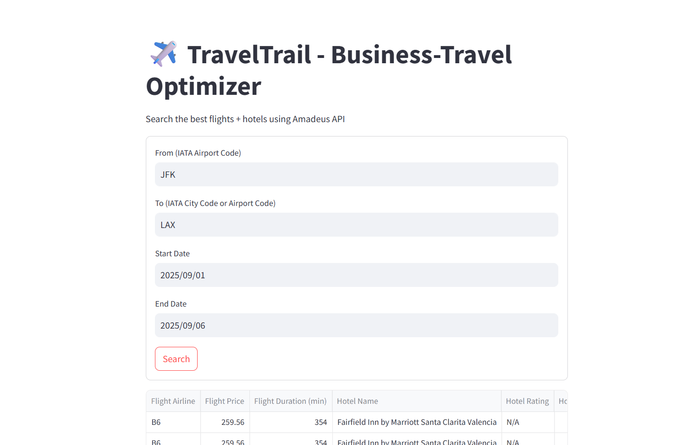
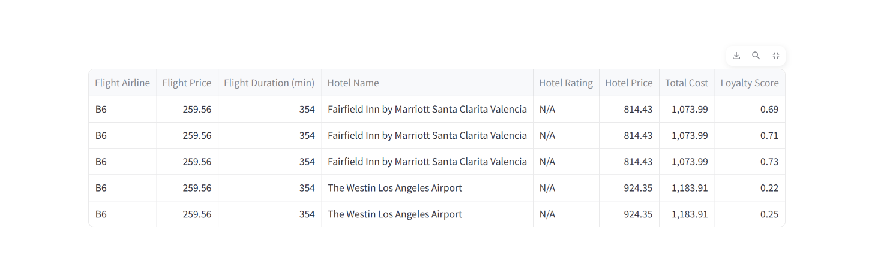

# ✈️ TravelTrail – Business Travel Optimizer

## 📖 Overview
**TravelTrail** is a Streamlit web application that helps business travelers find and rank the **best flight + hotel combinations**.  
It uses the **Amadeus Travel API** to fetch real-time flight and hotel data, then ranks the results based on:
- **Total cost**
- **Flight duration**
- **Randomized loyalty score** (for demonstration)

---

## ✨ Features
- 🔍 Search flights between cities for given travel dates
- 🏨 Search hotels in the destination city for matching dates
- 📊 Rank and recommend **top 5** flight + hotel combinations
- 🛠 Uses **Amadeus API** for real-time results
- 💻 Built with **Streamlit** for a simple and interactive UI
- 🗂 Modular code structure (separate files for config, flights, hotels, and utilities)

---

## 📂 Project Structure

---

## 🖼 Screenshots




---

## ⚙️ Prerequisites
- Python **3.9+**
- pip (Python package manager)
- An [Amadeus Developer Account](https://developers.amadeus.com/) (for API credentials)

---

## 🚀 Installation & Setup

### 1️⃣ Clone the Repository
```bash
git clone https://github.com/nitinrana1504/TravelTrail-Business-Travel-Optimizer.git
cd TravelTrail-Business-Travel-Optimizer

---
## Set Environment Variables
```
